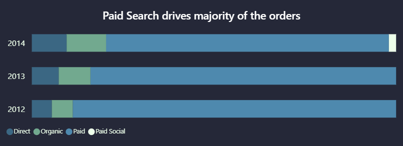
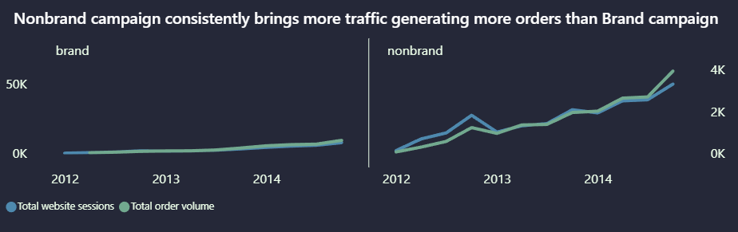

# ecommerce-marketing-funnel-analysis

Analyzed e-commerce marketing performance using session-level data to evaluate channels, campaign efficiency, and funnel health. Conducted analysis using SQL and built a BI dashboard to identify conversion drivers, drop-offs, and optimization opportunities across channels.

# Table of contents

- [Background and Overview](#background-and-overview)

- [Data Structure and Overview](#data-structure-and-overview) 

- [Executive Summary](#executive-summary)

- [Insights Deep Dive](#insights-deep-dive)

- [Recommendations](#recommendations)

- [Assumptions and Caveats](#assumptions-and-caveats)

- [Appendix Summary](#appendix-summary) 

# Background and Overview

This analysis is conducted using an e-commerce database for Fuzzy Factory, an online retailer that has sold teddy bears since 2012 and has progressively expanded and diversified its product offerings over time. The business relies heavily on digital marketing to drive traffic, customer acquisition, and revenue growth.

The primary objective of this analysis is to **support revenue growth** and is intended to support:

1. **Marketing and Growth teams** responsible for marketing mix planning, channel stratergy execution and campaign optimisation. 

2. **E-commerce and Conversion Optimization teams** responsible for improving on-site user experience, reducing funnel friction, and increasing conversion efficiency.

Insights and recommendations are developed in the following areas-

**1. Executive Performance Overview:** evaluates overall business scale, growth, and efficiency using *website sessions,orders and gross revenue,conversion rate(CVR) and revenue per session(RPS)*.

**2. Channel Performance:** assesses how different marketing channels contribute to volume and efficiency using *sessions, orders, and revenue by channel,conversion rate by channel and revenue per session by channel*.

**3. Campaign Performance:**  Compares campaign performance within a channel using _order volume, conversion rate, RPS, and gross revenue_ .

**4. Paid Search Channel Funnel Health (brand campaign vs nonbrand campaign):** Evaluates the performance of paid search channel by comparing brand and nonbrand campaign traffic through the conversion funnel using *conversion rates,conversion rate gap (percentage points) ,funnel entry rates and stage-level drop-offs and checkout completion rates*.

**5. Unpaid Search Channel Funnel Health(organic search and direct traffic):** evaluates funnel performance for organic search and direct raffic channels by analysing  funnel behavior using *funnel conversion rates, conversion rate gap (percentage points),stage-level funnel drop-off percentages and checkout completion rates*.

link for dashboard: https://github.com/rutujads-1/ecommerce-marketing-funnel-analysis/blob/main/ToySore_Ecommerce_DB_Dashboard.pbix

link for sql analysis: https://github.com/rutujads-1/ecommerce-marketing-funnel-analysis/blob/main/SQL_analysis_maincodefile_ecommerece_marketing.sql

# Data Structure and Overview 

Fuzzy Factory's database structure as seen below consists of 6 tables-

1. `orders`-  Contains 280K records where each row corresponds to a unique order_id, when the order was placed and which session it came from and the details about the items purchases like the prices. 

2. `order_items` -Contains 320K records where each row corresponds to a unique order_items_id which give details about the contents of orders. 

3. `order_item_refunds`- Contains ~9K records where each row corresponds to a refund for an order.

4. `products`- Contains 4 records with each row being a unique product_id along with the name and launch date.

5. `website_sessions`- Contains 470K records where each row represents a unique website_session_id, when the session was created, where the session came from and the marketing parameters tracked for the same.

6. `website_pageviews`- Contains 1M records each row represents a unique pageview_id representing the different pageview across a wesbite session. 

 
 

  

 
 

Prior to the analysis, exploratory data analysis (EDA) was performed for quality control and familirization with the datasets. The SQL queries utilised for intital EDA can be found here- https://github.com/rutujads-1/ecommerce-marketing-funnel-

**Dataset modelling and simplification**

The dataset was simplified using SQL views to remove unnecessary attributes and structure the data specifically for analysis and visualisation.  

All dashboards and insights are based on these analytical views rather than the raw source tables.

Views Used:

1. `view_fact_table_sessions` – Session-level view with marketing channels 
    
2.  `view_fact_orders` – Order-level view including gross revenue, refunds, net revenue, and profit metrics
   
3. `view_funnelsessiontable` – Funnel progression flags across key website stages
  
4. `vw_dim_products` – Product dimension with product names and launch dates
  

 
 

  

 
 

link for sql queries used to create views: https://github.com/rutujads-1/ecommerce-marketing-funnel-analysis/blob/main/SQL_table_views.sql

# Executive Summary
 

  
  

 

*note: Paid social channel was introduced in 2014 while rest of channels have been in place since 2012*

 

  
  

 
 

Between 2012 and 2014, the business recorded approximately **409K website sessions**, resulting in **27K orders** and **$1.6M in gross revenue**. Paid Search was the dominant channel, accounting for roughly **81%** of total website traffic.

Website sessions increased steadily over the three-year period, coinciding with new product launches. **Importantly, order volumes scaled proportionally with traffic growth, indicating that higher session volumes translated into tangible business outcomes rather than superficial traffic gains. With increase in sessions year over year, overall conversion performance also  improved year over year, suggesting that traffic quality was maintained as the business scaled.**

Paid search which drives the traffic, unlike organic search and direct traffic which are cost free channels, requires considerable amount of investments. Given the above finding, marketing teams should continue allocating the same budget to the paid search channel since increased traffic is translating to conversions.

Further investigating into the movement of sessions and order volumes, a pronounced surge in both sessions and orders was consistently observed during the Q4 period across all years with the driver of the search being the main product- The Original Mr Fuzzy. I hypothesize this pattern is driven by holiday season demand, supported by the fact that conversion rates during Q4 either increased or remained stable, indicating sustained user intent. 

# Insights Deep Dive

## Channel Performance

Website traffic is segmented into four channels based on the dataset: **Paid search and Paid Social search, Organic search and Direct**. Paid search, organic, and direct channels are present throughout the analysis period (2012–2014), while paid social was introduced in 2014.

Harnessing traffic through paid search and paid social search comes with a significant amount of marketing costs while direct and organic searches have no associated costs and thus the goal here is to find stratergies to leverage these channels by comparing channel performances using a combination of efficiency and revenue metrics, including: order volume,conversion rate, gross revenue generated and revenue per session.

**Order Volume By Channel**

  

 
 
 

Conversion rates across channels have increased over time, with organic search and direct performing at levels comparable to paid search, despite paid search operating at  a significantly higher traffic volume. Since conversion rates across channels are at par, we need a stratergy to improve brand awareness and stickiness so that the traffic we attract from paid search, which is almost 81%, could then start coming through organic searches and direct traffic channels. 

**Gross Revenue By Channel**

  

 
 

Gross revenue trends closely track order volume, with paid search generating the highest total revenue ($1.3M) due to its ability to scale traffic. In contrast, organic search traffic and direct traffic contribute lower absolute revenue primarily as a function of lower session volumes, rather than weaker per-session performance. This indicates that differences in revenue contribution across channels are volume-driven rather than efficiency-driven.

 

**Revenue per session By Channel**

  
  
  

 
 

Revenue per session is broadly comparable across paid search, organic search and direct traffic channels, indicating that sessions from each source generate similar economic value. Notably, organic search traffic and direct traffic channels maintain this level of revenue efficiency despite substantially lower traffic volumes, indicating that these channels are high-efficiency channels. 

## Campaign Performance

This section analyses differences in brand awareness, user intent, and conversion efficiency between brand and nonbrand campaigns.

**Traffic and Order Volume**

  
  
  

 

Nonbrand campaign consistently dominate paid search traffic, contributing **approximately 90% of paid search sessions** between 2012 and 2014. This higher traffic volume translated into a greater number of orders relative to brand campaigns throughout the period, positioning **nonband as the primary driver of scale** within paid search.

In my view, this distribution suggests that a large proportion of demand is captured through generic, nonbrand queries, indicating that **brand awareness** is **not yet the primary entry point** for a large share of users at the top of the funnel.

**Conversion Efficiency**

  

 
 

Although ~ 90% paid search traffic comes from nonbrand campaign, the conversion rates across brand and nonbrand are comparable. Since the business invests more in nonbrand keywords and given that nonbrand campaign drives traffic but brand and nonbrand campaigns convert at a comparable rate, we should work on performance-to-brand conversion stratergies which focus on converting users acquired through nonbrand campaign into users who actively seek out and search for the brand.

### Drivers of Campaign Performance Differences

Further breakdown of campaign performance indicates that device type and ad content contribute meaningfully to observed differences in sessions, conversion and order volume.

**Device Type**

Across nonbrand and brand campaigns, **desktop** brings in more traffic than **mobile**. Almost **72%** of nonbrand campaign traffic and **65%** of brand campaign traffic comes from desktop which suggest that device experience plays a role in overall campaign efficiency.

  

 
 

**Ad Content (UTM Content)**

Two different variations of Google and Bing ads are used across nonbrand and brand campaigns.**b_ad_1 and g_ad_1** are used in **nonbrand** campaigns while **b_ad_2 and g_ad_2** are used in **brand** campaigns. 

Comparison of **Google and Bing ad** variations within both brand and nonbrand campaigns shows that both variations achieved comparable conversion rates but google ads drove significantly higher session and traffic volumes. Since google ads drive more traffic to the wesbite which leads to orders with comparable conversion rates to bing ads, ad spend in bing ads should be re-evaluated. 

## Funnel Analysis- Paid Search Channel (Brand campaign vs Nonbrand campaign)

To identify where improvements in conversion performance can be most effectively achieved, funnel analysis is applied to paid search sessions, segmented into brand and nonbrand campaigns. 

The objective of this analysis is to determine which stages of the purchase funnel exhibit the highest drop-offs and therefore represent the greatest opportunities for optimization. For clarity, the funnel is defined as follows:

1. **Top of funnel:** Landing pages and product listing/discovery pages

2. **Middle of funnel:** Product detail pages and add-to-cart interactions

3. **Bottom of funnel:** Checkout experience, including shipping, billing, and order completion

 
 

  
  

 
 

 

  
  

 

**1. Top of the Funnel**

Significant top-of-funnel drop-off is observed across both brand (~40%) and nonbrand (~46%) campaign traffic, with **nearly half of users failing to reach product pages**. This highlights a clear opportunity to optimize landing pages, particularly in how quickly and clearly products are surfaced.

**The drop-off is more pronounced on mobile devices**, suggesting that mobile usability, page load performance, or content hierarchy may be key drivers of early-stage attrition.

**2. Middle of the funnel**

The middle funnel exhibits significant attrition at the add-to-cart stage, with approximately **55% drop-off** observed across both **brand and nonbrand campaign traffic**. This indicates that a substantial share of users disengage at the product detail page level, failing to translate browsing interest into purchase intent.

This attrition can likely be attributed to brand stickiness and loyalty as users could be comparing other product offerings leading to this drop off. To address this stratergies to introduce visible offers, loyalty benefits and value cues on product pages can be experimented with.

**3. Bottom of the Funnel**

The bottom of the funnel shows meaningful attrition during the checkout stage across nonbrand and brand campaigns, indicating potential friction within the checkout experience, particularly across shipping and billing steps.

Device-level analysis suggests that **checkout abandonment varies significantly by device**. Desktop users exhibit lower drop-off rates overall (45% for brand campaign, 48% for nonbrand campaign) compared to mobile users, where abandonment is substantially higher (64% for brand campaign, 61% for nonbrand campaign).

This disparity supports the hypothesis that device experience plays a material role in checkout completion, with mobile users likely encountering greater friction during shipping and payment flows. Potential contributors include form complexity, page load performance, input usability, or payment method availability on mobile devices.

## Funnel Analysis- Unpaid Search Channel (Organic search and Direct )

To evaluate whether organic search and direct traffic can be scaled without compromising conversion efficiency, funnel analysis was applied to unpaid channels. The assessment examines stage-level progression and drop-offs within the purchase funnel to determine whether growth constraints stem from acquisition volume or funnel performance.

  
  

 
 

 

  
  

 

Initial funnel validation shows broadly consistent stage-level patterns across organic search and direct traffic.Deeper analysis reveals similar attrition patterns across the various stages of the funnel as seen in the paid channel.

**1. Top of the funnel**

Drop offs from the landing page to the product page are comparable across organic search traffic(39.2%) and direct channel traffic( 40.70%). 

**2. Middle of the funnel**

Drop offs in the middle of the funnel remain high similar to paid search traffic funnels. The drop of rates across the unpaid channels are comparable.

**3. Bottom of the funnel**

Drop offs in the bottom of the funnel, similar to paid search traffic are high for both direct traffic (50.61%) and organic search traffic (50.15%).

# Recommendations 

**1. Checkout Optimization by Device (Bottom of Funnel)**
   
Checkout attrition is significantly higher in both brand and nonbrand traffic.This is the **high priority stage for optimisation** because of the fact that users coming to this stage have the **higgest likelihood of making a purchase**. 

**Estimated Impact**

Applying a conservative benchmark-based scenario-**improving bottom-funnel- specific- shipping to conversion rate in brand campaign traffic funnel from 68.2% to 80% and in nonbrand campaign traffic funnel from 67.8% to 80%** while holding traffic and average order value constant- suggests a potential **17.3% increase in brand campaign** revenue and **17.9% increase in nonbrand campaign revenue**.

Based on observed brand campaign revenue of ~ $156 K and nonbrand campaign revenue of ~ $1.12M  over the analysis period, this represents an estimated **$32K in incremental revenue in brand campaign** and **~$238K in incremental revenue in nonbrand campaign** without additional acquisition spend.

**2. Landing Page Optimization (Top of Funnel)**

Analysis indicates substantial top-of-funnel drop-off across channels, suggesting that a significant share of users do not progress from landing pages to product discovery. 

This highlights the need to optimize landing pages to more effectively surface products, align messaging with user intent, and reduce early-stage friction. Improvements in content hierarchy, load performance, and clarity of value proposition could help increase progression into the product exploration stage.

**3. Introduction of site level campaigns such as loyalty programs to improve brand stickiness**

Conversion rates across channels are comparable. Since 81% of the traffic is driven by paid searches, improving brand stickiness for this segment could lead to this segment converting to organic searches or direct traffic which would prove to be cost efficient. This could also help in reducing the mid-funnel attrition. 

# Assumptions and Caveats 

1. Impact estimates are based on conservative industry benchmarks and assume constant traffic volume, stable average order value, and improvement at a single funnel stage; results are directional and reflect associations observed in session-level data rather than causal effects.

2. Marketing spends are not known and are assumed to be higher in some areas and lower across others. 

3. Funnel analysis is performed at an aggregate level; performance differences across individual landing page, product page, and checkout variants are not explicitly analyzed.

4. Product-level performance differences are not isolated and may contribute to observed funnel behavior.

# Appendix Summary

 Link to Impact Estimation working: https://github.com/rutujads-1/ecommerce-marketing-funnel-analysis/blob/main/Estimation%20%26%20Impact.xlsx
 

   
