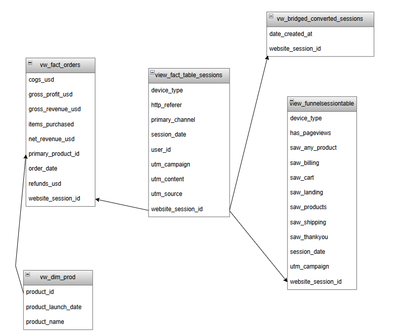

# ecommerce-marketing-funnel-analysis

Analyzed e-commerce marketing performance using session-level data to evaluate acquisition channels, campaign efficiency, and funnel health. Built SQL models and BI dashboards to identify conversion drivers, drop-offs, and optimization opportunities across channels.

# Table of contents

1. Project Background

2. Data Structure and Overview

3. Executive Summary

4. Insights Deep Dive

5. Recommendations

6. Assumptions and Caveats

7. Appendix Summary 

# Background and Overview

This analysis is conducted using an e-commerce database for Fuzzy Factory, an online retailer that has sold teddy bears since 2012 and has progressively expanded and diversified its product offerings over time. The business relies heavily on digital marketing to drive traffic, customer acquisition, and revenue growth.

The primary objective of this analysis is to **support profitable revenue growth** and is intended to support two primary business audiences:

1. **Marketing and Growth teams**, responsible for acquisition strategy, campaign optimization, and channel investment decisions.

2. **E-commerce and Conversion Optimization teams**, responsible for improving on-site user experience, reducing funnel friction, and increasing conversion efficiency.

Insights and recommendations are developed in the following areas-

**1. Executive Performance Overview:** evaluates overall business scale, growth, and efficiency using *website sessions,orders and gross revenue,conversion rate(CVR) and revenue per session(RPS)*.

**2. Acquisition Channel Performance:** assesses how different marketing channels contribute to volume and efficiency using *sessions, orders, and revenue by channel,conversion rate by channel and revenue per session by channel*.

**3. Campaign Performance:**  Compares campaign performance within a channel using _sessions, orders, conversion rate, RPS, and gross revenue_ to highlight what is working best.

**4. Paid Funnel Health (brand vs nonbrand):** Evaluates the performance of Paid Search campaigns by comparing brand and nonbrand traffic through the conversion funnel, with a focus on identifying differences in intent, efficiency, and friction across key funnel stages. This analysis uses both outcome metrics and funnel diagnostics, including- *brand and nonbrand funnel conversion rates,conversion rate gap (percentage points) between brand and nonbrand traffic,funnel entry rates and stage-level drop-offs and checkout completion rates*.

**5. Unpaid Channel Funnel Health(organic and direct):** evaluates funnel performance for Direct and Organic traffic analysing  funnel behavior across both channels  using *funnel conversion rates for direct and organic traffic, conversion rate gap (percentage points) between direct and organic channels, stage-level funnel drop-off percentages and checkout completion rates*.

link for dashboard:

link for sql query:

# Data Structure and Overview 

Fuzzy Factory's database structure as seen below consists of 6 tables- `orders`, `order_items`,`order_item_refunds`,`products`, `website_sessions` and `website_pageviews` with a total of 1,735,068 records. 

 
 

  

 
 

Prior to the analysis, exploratory data analysis (EDA) was performed for quality control and familirization with the datasets. The SQL queries utilised for intital EDA can be found here- 

**Dataset modelling and simplification**

The dataset was simplified using SQL views to remove unnecessary attributes and structure the data specifically for analysis and visualisation.  

All dashboards and insights are based on these analytical views rather than the raw source tables.

Views Used:

1. `view_fact_table_sessions` – Session-level view with derived marketing channels and device attributes
    
2.  `view_fact_orders` – Order-level view including gross revenue, refunds, net revenue, and profit metrics
   
3. `view_funnelsessiontable` – Funnel progression flags across key website stages
  
4. `vw_dim_products` – Product dimension with product names and launch dates
  
5. `vw_bridged_converted_sessions` – Bridge view identifying sessions that resulted in an order

 
 

  

 
 

# Executive Summary
 
 

  
  

 

  
  

 
 

Between 2012 and 2014, the business recorded **409K website sessions**, generating **27K orders** and **$1.6M in gross revenue**. **Paid Search** emerged as the dominant acquisition channel, contributing approximately **81%** of total website traffic.

As website traffic increased over this period, both orders and conversion rates improved year-over-year, indicating that growth in traffic translated into meaningful business outcomes. 

Orders scaled proportionally with sessions, and key acquisition channels maintained stable or improving conversion performance across years. 

This demonstrates that traffic growth did not dilute user intent and **suggests** that the business successfully attracted and converted high-intent users as scale increased.

Given the strong year-over-year growth in traffic, orders, and conversion rate — alongside the heavy reliance on paid search which raises questions around efficiency, scalibility and dependency risk — the next step is to evaluate performance at the acquisition channel level.

Channel-level analysis will assess whether growth was driven by efficient, high-intent channels or by sheer traffic volume, identify relative channel effectiveness, and surface opportunities to optimize or diversify acquisition strategy.

# Insights Deep Dive

## Channel Performance

Website traffic is segmented into four acquisition channels based on the dataset: **Paid Search, Organic, Direct, and Paid Social**. Paid Search, Organic, and Direct channels are present throughout the analysis period (2012–2014), while Paid Social was introduced in 2014.

Channel performance is evaluated using a combination of efficiency and revenue metrics, including: conversion rate, gross revenue generated and revenue per session.

This analysis compares how each channel contributes to traffic scale, conversion efficiency, and revenue generation, providing a foundation for identifying channels that drive volume versus those that deliver higher efficiency.

**Conversion Rate By Channel**

 
 

  

 
 

Organic and direct channels exhibit the highest conversion rates(7.4% and 7% respectively) despite lower session volumes, with consistent year-over-year improvement, a pattern consistent with higher user intent. Paid Search, while driving the majority of traffic, also shows improving conversion rates over time, indicating that increased traffic did not dilute conversion efficiency.

**Gross Revenue By Channel**

 
 

  

 
 

Gross Revenue trends closely follow order volume, with Paid Search generating the highest revenue($1.28M) due to its scale. Organic and direct channels contribute less total revenue, primarily due to lower traffic volumes rather than weaker performance.

**Revenue per session**
 
 

  
  
  

 
 

Revenue per session is broadly comparable across Paid ($3.88), Organic($4.40), and Direct channels($4.23), indicating that sessions from each channel generate similar economic value. Notably, organic and direct traffic achieve comparable revenue efficiency despite lower session volumes, reinforcing their role as high-efficiency acquisition sources.

**Channel-level analysis confirms that traffic growth was achieved without a decline in purchasing intent**. While paid search successfully scaled traffic, orders, and revenue without a loss in efficiency, organic and direct channels demonstrated superior conversion efficiency and comparable revenue per session. This indicates that overall growth was driven by a mix of scalable paid acquisition and high-intent, high-efficiency non-paid channels.

Having established Paid Search as the primary acquisition channel driving both traffic and orders, the next step is to understand _what within this channel is driving performance._Further, campaign-level analysis enables deeper evaluation of user intent by distinguishing between brand and non-brand search activity. By assessing how these campaign types contribute to sessions, orders, and conversion rates, we can determine whether Paid Search performance is primarily driven by high-intent brand demand or by effective non-brand acquisition, and identify the key drivers behind conversion.

## Campaign Performance

Paid Search is the primary driver of website traffic and revenue, warranting deeper analysis at the campaign level to understand differences in user intent and efficiency between brand and nonbrand campaigns.

**Traffic and Order Volume**

 
 

  
  

 
 

Nonbrand campaigns consistently dominate paid search traffic, contributing approximately 90% of Paid sessions across 2012–2014. 
This higher traffic volume translated into a greater number of orders compared to brand campaigns throughout the period, making nonbrand the primary driver of scale within Paid Search.

**Revenue Contribution**
 
 

  

 
 

Gross revenue increased steadily from 2012 to 2014, with nonbrand campaigns accounting for the ~ 88% of paid search revenue. This indicates that revenue growth was largely driven by traffic scale from nonbrand acquisition rather than conversion efficiency alone.

**Conversion Efficiency**

 
 

  

 
 

Despite lower traffic volumes, brand campaigns consistently achieved higher conversion rates than nonbrand campaigns across all years. This reflects stronger user intent among brand traffic, as users searching for the brand are more likely to convert once they enter the site.

**Revenue per Session (RPS)**

  
 

  

 
 

Across all four product categories, brand campaigns generated higher revenue per session than nonbrand campaigns. This further reinforces the conclusion that brand traffic, while smaller in volume, is more efficient at monetization once acquired.

Together, these findings highlight a clear trade-off within Paid Search: nonbrand campaigns drive scale and revenue growth, while brand campaigns deliver superior efficiency and monetization per session.

### Drivers of Campaign Performance Differences

Further breakdown of campaign performance indicates that device type and ad content contribute meaningfully to observed differences in conversion and order volume.

**Device Type**

Across nonbrand and brand campaigns, **desktop traffic** consistently outperformed mobile traffic in terms of conversion rate, order volume, and revenue generation. While mobile sessions contributed incremental traffic, lower conversion rates suggest that device experience plays a role in overall campaign efficiency.

**Ad Content (UTM Content)**

Comparison of Google and Bing ad variations within both brand and nonbrand campaigns shows that **Bing ads** consistently achieved comparable or higher conversion rates and revenue per session despite significantly lower traffic volumes. This suggests that Bing ads attract higher-intent users but suffer from limited reach relative to Google ads. 

These patterns indicate that campaign performance differences are influenced not only by traffic volume, but also by device experience and ad-level targeting, highlighting opportunities for optimization beyond budget allocation alone.

While campaign-level analysis clarifies the intent mix driving acquisition performance, it does not explain how effectively users progress through the conversion journey. To address this, the analysis advances to funnel-level evaluation across paid and non-paid channels.

## Funnel Analysis (Brand vs Nonbrand)

To identify where improvements in conversion performance can be most effectively achieved, funnel analysis is applied to Paid Search sessions, segmented into Brand and Non-Brand campaigns. 

The objective of this analysis is to determine which stages of the purchase funnel exhibit the highest drop-offs and therefore represent the greatest opportunities for optimization.

 
 

  
  

 
 

 

  
  

 

**Nonbrand Funnel Analysis**

Year-wise analysis of Paid Non-Brand funnel drop-offs shows consistent improvement across all stages from 2012 to 2014. 

However, three stages continue to exhibit elevated drop-off rates by 2014. The largest early-stage drop-off(46.21%) occurs between entry and product discovery, indicating further opportunities to improve landing page relevance for discovery-driven users.

Mid-funnel drop-off between product detail and cart(55.11%) remains high, which is expected given the exploratory nature of non-brand traffic. 

Most critically, checkout-to-conversion drop-off remains close to 50% despite improvements over time, suggesting persistent friction at the final conversion stage for high-intent users.

**Brand Funnel Analysis**

Brand campaign funnel analysis reveals three persistent friction points across years.

Despite improvements over time, product detail to cart drop-off(55.13%) remains elevated, indicating hesitation at the product decision stage even among brand-aware users.

Checkout-to-conversion drop-off is ~ 49%, suggesting unresolved checkout friction impacting high-intent traffic.

Additionally, consistent drop-off between entry and product discovery( ~40%) highlights opportunities to improve navigation and product visibility on entry pages rather than issues with acquisition intent.

## Funnel Analysis (Organic and Direct)

To evaluate whether Organic and Direct traffic can be scaled without compromising conversion efficiency, funnel analysis is applied to unpaid acquisition channels. This assessment examines stage-level progression and drop-offs within the purchase funnel to determine whether existing conversion performance is supported by stable funnel behavior or is sensitive to increases in traffic volume.

 
 

  
  

 
 

 

  
  

 

Funnel validation for Organic and Direct traffic shows consistent stage-level behavior with no disproportionate drop-off at any single stage. 

While mid- and late-funnel drop-offs remain material, they mirror patterns observed across other channels, indicating a structurally sound funnel.

This suggests that scaling Organic and Direct traffic is unlikely to dilute efficiency, and that growth constraints are driven by acquisition volume rather than funnel performance.

# Recommendations 

**1. Scale Non-Brand Acquisition Through SEO and Demand Capture**

Non-Brand campaigns account for approximately 90% of Paid Search sessions and consistently drive higher traffic volumes, orders, and total revenue across 2012–2014.

Recommendation:

1. Increase investment in non-brand demand capture, particularly through SEO and scalable acquisition channels, to continue driving traffic and order growth.

2. Use Non-Brand performance as the primary lever for volume growth while monitoring conversion rates to ensure efficiency is maintained.
   

**2. Invest in Brand Awareness to Expand a High-Efficiency Traffic Segment**
   
Brand campaigns consistently achieve higher conversion rates and higher revenue per session than Non-Brand campaigns, despite significantly lower traffic volumes.

Recommendation:

1. Increase focus on brand awareness initiatives (brand-focused SEO, upper-funnel marketing, and brand campaigns) to grow Brand traffic volume.

2. Treat Brand traffic as a high-intent segment with strong monetization potential rather than a secondary acquisition channel.
   

**3. Rebalance Paid Campaign Mix Toward High-Intent Ad Content**
   
Ad-level (UTM content) analysis shows that certain ad variants (e.g., Bing-based ads) deliver comparable or higher conversion rates and revenue per session relative to Google ads, despite lower traffic volumes.
 
Recommendation:

1. Gradually reallocate budget toward high-performing ad content and platforms that demonstrate stronger conversion efficiency.

2. Test controlled increases in exposure for high-efficiency ad variants to assess scalability without compromising ROI.

**4. Optimize Checkout Completion for Non-Brand Traffic**

Funnel analysis shows that Non-Brand Paid traffic, which contributes the majority of Paid Search sessions and revenue, experiences a significant drop-off at the shipping-to-purchase stage(50.39%). This drop-off occurs late in the funnel, after users have demonstrated strong purchase intent, indicating that checkout friction—rather than acquisition quality—is limiting revenue conversion.

Recommendation:

1. Optimize checkout performance across devices, particularly mobile, where late-funnel friction may be amplified.

2. Test trust and reassurance elements (e.g., delivery timelines, return policies, security indicators) at the shipping and payment stages.

**Estimated Impact**

Applying a conservative benchmark-based scenario—improving checkout completion for Non-Brand traffic from ~49.6% to 55% while holding traffic and average order value constant—suggests a potential ~10–11% increase in Non-Brand revenue. 

Based on observed Non-Brand revenue of approximately $1.35M over the analysis period, this represents an estimated **$145K in incremental revenue without additional acquisition spend.**

 

# Assumptions and Caveats 

1. Impact estimates are based on conservative industry benchmarks and assume constant traffic volume, stable average order value, and improvement at a single funnel stage; results are directional and reflect associations observed in session-level data rather than causal effects.

2. 

   
