# ecommerce-marketing-funnel-analysis

Analyzed e-commerce marketing performance using session-level data to evaluate acquisition channels, campaign efficiency, and funnel health. Built SQL tables and a BI dashboard to identify conversion drivers, drop-offs, and optimization opportunities across channels.

# Table of contents

1. [Background and Overview](#background-and-overview)

2. [Data Structure and Overview](#data-structure-and-overview) 

3. [Executive Summary](#executive-summary)

4. [Insights Deep Dive](#insights-deep-dive)

5. [Recommendations](#recommendations)

6. [Assumptions and Caveats](assumptions-and-caveats)

7. [Appendix Summary](appendix-summary) 

# Background and Overview

This analysis is conducted using an e-commerce database for Fuzzy Factory, an online retailer that has sold teddy bears since 2012 and has progressively expanded and diversified its product offerings over time. The business relies heavily on digital marketing to drive traffic, customer acquisition, and revenue growth.

The primary objective of this analysis is to **support profitable revenue growth** and is intended to support:

1. **Marketing and Growth teams** responsible for acquisition strategy, campaign optimization, and channel investment decisions.

2. **E-commerce and Conversion Optimization teams** responsible for improving on-site user experience, reducing funnel friction, and increasing conversion efficiency.

Insights and recommendations are developed in the following areas-

**1. Executive Performance Overview:** evaluates overall business scale, growth, and efficiency using *website sessions,orders and gross revenue,conversion rate(CVR) and revenue per session(RPS)*.

**2. Acquisition Channel Performance:** assesses how different marketing channels contribute to volume and efficiency using *sessions, orders, and revenue by channel,conversion rate by channel and revenue per session by channel*.

**3. Campaign Performance:**  Compares campaign performance within a channel using _sessions, orders, conversion rate, RPS, and gross revenue_ to highlight what is working best.

**4. Paid Funnel Health (brand vs nonbrand):** Evaluates the performance of Paid Search campaigns by comparing brand and nonbrand campaign traffic through the conversion funnel using both- outcome metrics and funnel diagnostics, including- *conversion rates,conversion rate gap (percentage points) ,funnel entry rates and stage-level drop-offs and checkout completion rates*.

**5. Unpaid Channel Funnel Health(organic and direct):** evaluates funnel performance for Direct and Organic traffic channels analysing  funnel behavior across both channels  using *funnel conversion rates, conversion rate gap (percentage points),stage-level funnel drop-off percentages and checkout completion rates*.

link for dashboard:

link for sql query: https://github.com/rutujads-1/ecommerce-marketing-funnel-analysis/blob/main/SQL_queries_maincodefile_ecommerce_marketing.sql

# Data Structure and Overview 

Fuzzy Factory's database structure as seen below consists of 6 tables-

1. `orders`- Each row corresponds to a unique order_id, when the order was placed and which session it came from and the details about the items purchases like the prices. 

2. `order_items` - Each row corresponds to a unique order_items_id which give details about the contents of orders. 

3. `order_item_refunds`- Each row corresponds to a refund for an order.

4. `products`- Each row is a unique product_id along with the name.

5. `website_sessions`- Each row represents a unique website_session_id, when the session was created, where the session came from and the marketing parameters tracked for the same.

6. `website_pageviews`- Each row represents a unique pageview_id representing the different pageview across a wesbite session. 

 
 

  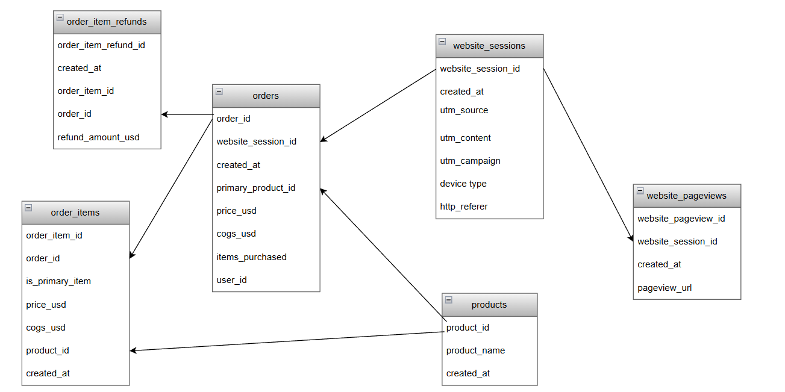

 
 

Prior to the analysis, exploratory data analysis (EDA) was performed for quality control and familirization with the datasets. The SQL queries utilised for intital EDA can be found here- https://github.com/rutujads-1/ecommerce-marketing-funnel-

**Dataset modelling and simplification**

The dataset was simplified using SQL views to remove unnecessary attributes and structure the data specifically for analysis and visualisation.  

All dashboards and insights are based on these analytical views rather than the raw source tables.

Views Used:

1. `view_fact_table_sessions` – Session-level view with derived marketing channels and device attributes
    
2.  `view_fact_orders` – Order-level view including gross revenue, refunds, net revenue, and profit metrics
   
3. `view_funnelsessiontable` – Funnel progression flags across key website stages
  
4. `vw_dim_products` – Product dimension with product names and launch dates
  
5. `vw_bridged_converted_sessions` – Bridge view identifying sessions that resulted in an order

 
 

  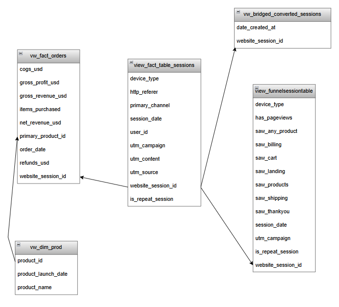

 
 

link for sql queries used to create views : https://github.com/rutujads-1/ecommerce-marketing-funnel-analysis/blob/main/SQL_views.sql

# Executive Summary
 

  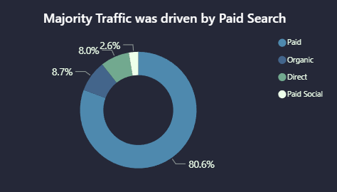
  

 

*note: Paid social channel was introduced in 2014 while rest of channels have been in place since 2012*

 

  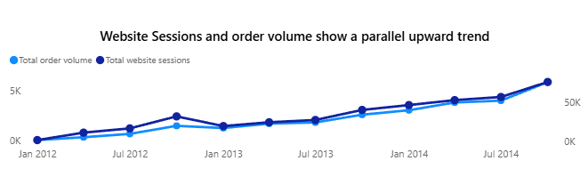
  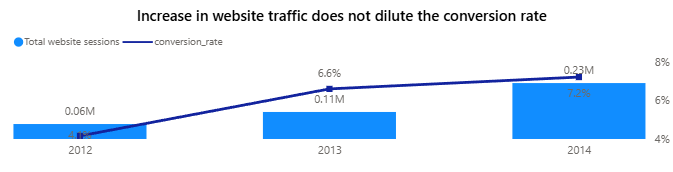

 
 

Between 2012 and 2014, the business recorded approximately **409K website sessions**, resulting in **27K orders** and **$1.6M in gross revenue**. Paid Search was the dominant channel, accounting for roughly **81%** of total website traffic.

Website sessions increased steadily over the three-year period, coinciding with new product launches. **Importantly, order volumes scaled proportionally with traffic growth, indicating that higher session volumes translated into tangible business outcomes rather than superficial traffic gains. With increase in sessions year over year, overall conversion performance also  improved year over year, suggesting that traffic quality was maintained as the business scaled.**

Paid search which drives the traffic,unlike organic and direct which are cost free channels,requires considerable amount of investments. Given the above finding, marketing teams can continue to allocate the amounts to paid search channels since increased traffic is translating to conversion and leading to orders.

Further investigating into the movement of sessions and order volumes, a pronounced surge in both sessions and orders was consistently observed during the Q4 period across all years. I hypothesize this pattern is driven by holiday season demand, supported by the fact that conversion rates during Q4 either increased or remained stable, indicating sustained user intent. 

# Insights Deep Dive

## Channel Performance

Website traffic is segmented into four acquisition channels based on the dataset: **Paid Search and paid social search, Organic search and Direct**. Paid Search, Organic, and Direct channels are present throughout the analysis period (2012–2014), while Paid Social was introduced in 2014.

Harnessing traffic through paid search and paid social search comes with a significant amount of marketing costs associated while direct and organic searches have no associated costs and thus the goal here is to find stratergies harness these channels by comparing channel performances using a combination of efficiency and revenue metrics, including: conversion rate, gross revenue generated and revenue per session.

**Conversion Rate By Channel**

  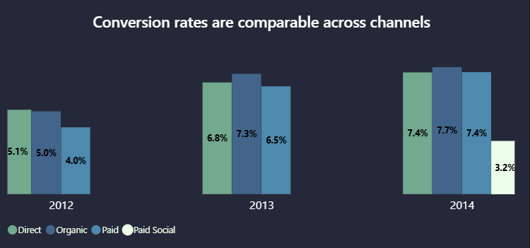

 
 

Conversion rates across channels have increased over time, with Organic and Direct performing at levels comparable to Paid search, despite Paid operating at significantly higher traffic volumes. Since conversion rates across channels are at par, we need a stratergy for to improve brand awareness and stickyness so that the traffic we attract from paid search, which is almost 81%, could be then get converted to organic searches and direct traffic. 

**Gross Revenue By Channel**

 
 

  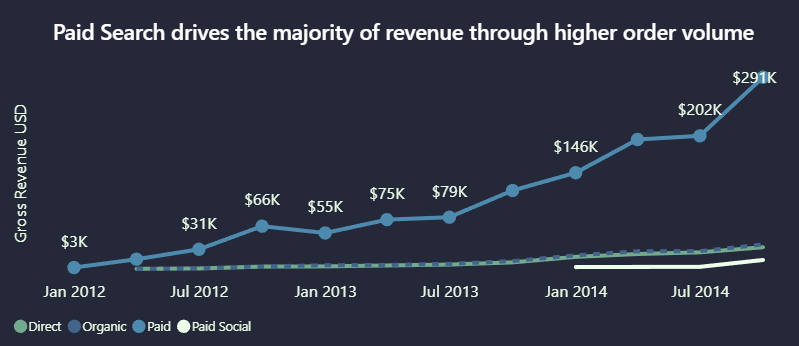

 
 

Gross revenue trends closely track order volume, with Paid Search generating the highest total revenue ($1.28M) due to its ability to scale traffic. In contrast, Organic and Direct contribute lower absolute revenue primarily as a function of lower session volumes, rather than weaker per-session performance. This indicates that differences in revenue contribution across channels are volume-driven rather than efficiency-driven.

**Revenue per session**

  
  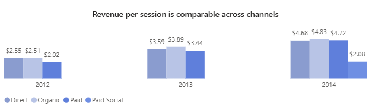
  

 
 

Revenue per session is broadly comparable across Paid ($3.88), Organic ($4.40), and Direct ($4.23) channels, indicating that sessions from each source generate similar economic value. Notably, Organic and Direct maintain this level of revenue efficiency despite substantially lower traffic volumes, reinforcing my interpretation that these channels are high-efficiency channels. 

## Campaign Performance

This section analyses differences in brand awareness, user intent, and conversion efficiency between brand and nonbrand campaigns.

**Traffic and Order Volume**

  

  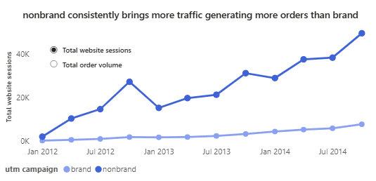
  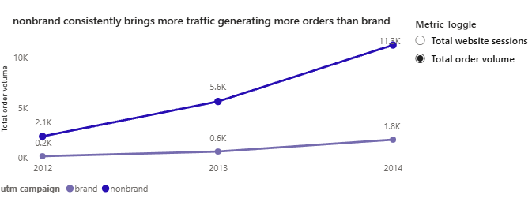

  

Nonbrand campaigns consistently dominate Paid Search traffic, contributing **approximately 90% of paid sessions** between 2012 and 2014. This higher traffic volume translated into a greater number of orders relative to brand campaigns throughout the period, positioning **nonband as the primary driver of scale** within Paid Search.

In my view, this distribution suggests that a large proportion of demand is captured through generic, nonbrand queries, indicating that **brand awareness** is **not yet the primary entry point** for a large share of users at the top of the funnel.

**Conversion Efficiency**

 
 

  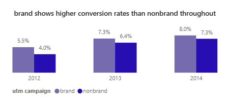

 
 

Despite lower traffic volumes, brand campaigns consistently achieved higher conversion rates than nonbrand campaigns across all years. This pattern reflects brand awareness among brand users, as searches containing the brand name are more likely to originate from users already familiar with the product.

**Revenue per Session (RPS)**

 
 

  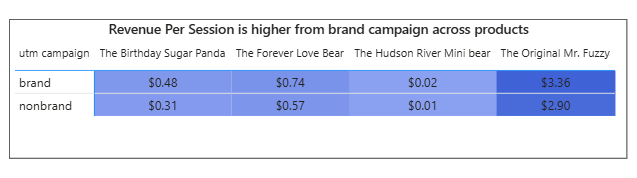

 
 

Across all four product categories, brand campaigns generated higher revenue per session than nonbrand campaigns. This further reinforces the conclusion that brand traffic is more efficient at monetization once acquired, even though it contributes a smaller share of overall traffic.

### Drivers of Campaign Performance Differences

Further breakdown of campaign performance indicates that device type and ad content contribute meaningfully to observed differences in conversion and order volume.

  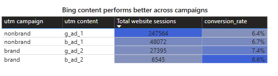

 
 

**Device Type**

Across nonbrand and brand campaigns, **desktop traffic** consistently outperformed mobile traffic in terms of conversion rate, order volume, and revenue generation. While mobile sessions contributed incremental traffic, lower conversion rates suggest that device experience plays a role in overall campaign efficiency.

**Ad Content (UTM Content)**

Comparison of Google and Bing ad variations within both brand and nonbrand campaigns shows that **Bing ads** consistently achieved comparable or higher conversion rates and revenue per session despite significantly lower traffic volumes. This suggests that Bing ads attract higher-intent users but suffer from limited reach relative to Google ads. 

## Funnel Analysis (Brand vs Nonbrand)

To identify where improvements in conversion performance can be most effectively achieved, funnel analysis is applied to Paid Search sessions, segmented into Brand and Non-Brand campaigns. 

The objective of this analysis is to determine which stages of the purchase funnel exhibit the highest drop-offs and therefore represent the greatest opportunities for optimization.For clarity, the funnel is defined as follows:

1. **Top of funnel:** Landing pages and product listing/discovery pages

2. **Middle of funnel:** Product detail pages and add-to-cart interactions

3. **Bottom of funnel:** Checkout experience, including shipping, billing, and order completion

 
 

  
  

 
 

 

  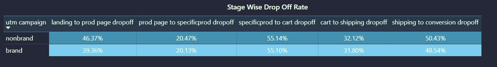
  

 

**1. Top of the Funnel**

Significant top-of-funnel drop-off is observed across both brand (~40%) and non-brand (~46%) traffic, with **nearly half of users failing to reach product pages**. This highlights a clear opportunity to optimize landing pages, particularly in how quickly and clearly products are surfaced.

**The drop-off is more pronounced on mobile devices**, suggesting that mobile usability, page load performance, or content hierarchy may be key drivers of early-stage attrition.

**2. Middle of the funnel**

The middle funnel exhibits significant attrition at the add-to-cart stage, with approximately **55% drop-off** observed across both **brand and non-brand traffic**. This indicates that a substantial share of users disengage at the product detail page level, failing to translate browsing interest into purchase intent.

While higher attrition among **non-brand traffic** is generally expected due to lower brand awareness and more exploration across other offerings the fact that **brand traffic exhibits a comparable drop-off** is unexpected. Given that brand searches typically reflect stronger purchase intent, this pattern suggests that **product page experience, pricing perception, or value communication** may be constraining conversion even among high-intent users.

To validate this hypothesis, repeat-session behavior within **Brand Search** was examined. Despite approximately **63% of brand sessions being repeat visits**, add-to-cart drop-off remains nearly identical for **repeat (55.02%) and non-repeat sessions (55.26%)**. This parity strongly indicates that mid-funnel loss is **experience-driven rather than intent-driven**, reinforcing the need for targeted improvements at the product page level.

**3. Bottom of the Funnel**

The bottom of the funnel shows meaningful attrition during the checkout stage across nonbrand and brand, indicating potential friction within the checkout experience, particularly across shipping and billing steps.

Device-level analysis suggests that **checkout abandonment varies significantly by device**. Desktop users exhibit lower drop-off rates overall (45% for brand, 48% for non-brand) compared to mobile users, where abandonment is substantially higher (64% for brand, 61% for non-brand).

This disparity supports the hypothesis that device experience plays a material role in checkout completion, with mobile users likely encountering greater friction during shipping and payment flows. Potential contributors include form complexity, page load performance, input usability, or payment method availability on mobile devices.

## Funnel Analysis (Organic and Direct)

To evaluate whether Organic and Direct traffic can be scaled without compromising conversion efficiency, funnel analysis was applied to unpaid acquisition channels. The assessment examines stage-level progression and drop-offs within the purchase funnel to determine whether growth constraints stem from acquisition volume or funnel performance.

  
  

 
 

 

  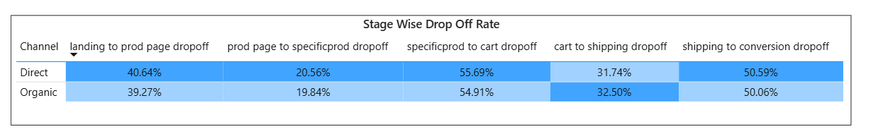
  

 

Initial funnel validation shows broadly consistent stage-level patterns across Organic and Direct traffic. However, deeper analysis reveals that **mid-funnel attrition** at the add-to-cart stage remains persistently high, and critically, this drop-off persists among **repeat sessions**, which account for a substantial share of traffic (**61% for Organic and 64% for Direct**).

The presence of significant mid-funnel loss among repeat and brand-aware users indicates that conversion inefficiencies are not primarily driven by lack of intent or awareness, but are instead concentrated at the product-to-cart transition. As a result, while Organic and Direct channels are often constrained by limited traffic supply, the data suggests that scaling acquisition alone would amplify existing funnel leakage rather than deliver proportional gains.

These findings indicate that mid-funnel optimization—particularly improving add-to-cart performance—is a prerequisite for efficient scaling within Organic and Direct channels.

# Recommendations 

**1. Checkout Optimization by Device (Bottom of Funnel)**
   
Checkout attrition is significantly higher on mobile devices compared to desktop across both brand and non-brand traffic, indicating that device-specific friction is a key contributor to bottom-of-funnel loss. Given that this is the easiest stage optimise because of the fact that users coming to this stage have the higgest likelihood of making a purchase optimization efforts should prioritize the imporvement of checkout experience first.

**Estimated Impact**

Applying a conservative benchmark-based scenario—**improving mid-funnel -specific product to cart,ie, add-to-cart rate in brand search traffic  funnel** from 44.9%  to 50%  while holding traffic and average order value constant—suggests a potential ~11.35% increase in Brand revenue.

Based on observed Brand revenue of approximately $156 K over the analysis period, this represents an estimated $19.7K in incremental revenue without additional acquisition spend.

**2. Product Page Optimization (Mid Funnel)**

Persistent mid-funnel attrition at the add-to-cart stage, including among repeat and brand-aware users, indicates that product detail pages are a critical bottleneck in the purchase journey. Improving the product detail pages is likely to improve stickyness which could lead to improvements in organic search and direct traffic as well.

**3. Landing Page Optimization (Top of Funnel)**

Analysis indicates substantial top-of-funnel drop-off across channels, suggesting that a significant share of users do not progress from landing pages to product discovery. 

This highlights the need to optimize landing pages to more effectively surface products, align messaging with user intent, and reduce early-stage friction. Improvements in content hierarchy, load performance, and clarity of value proposition could help increase progression into the product exploration stage.

**4. Introduction of site level campaigns such as loyalty programs to improve brand stickyness**

Conversion rates across channels are comparable. Since 81% of the traffic is driven by paid searches, improving brand stickyness for this segment could lead to this segment converting to organic searches or direct traffic which would prove to be cost efficient. 

# Assumptions and Caveats 

1. Impact estimates are based on conservative industry benchmarks and assume constant traffic volume, stable average order value, and improvement at a single funnel stage; results are directional and reflect associations observed in session-level data rather than causal effects.

2. Funnel analysis is performed at an aggregate level; performance differences across individual landing page, product page, and checkout variants are not explicitly analyzed.

3. Product-level performance differences are not isolated and may contribute to observed funnel behavior.

# Appendix Summary

 Link to Impact Estimation working: (https://github.com/rutujads-1/ecommerce-marketing-funnel-analysis/blob/main/Impact%20Estimation-%20add%20to%20cart%20rate%20improvent%20of%20brand%20funnel.xlsx)
 

   
